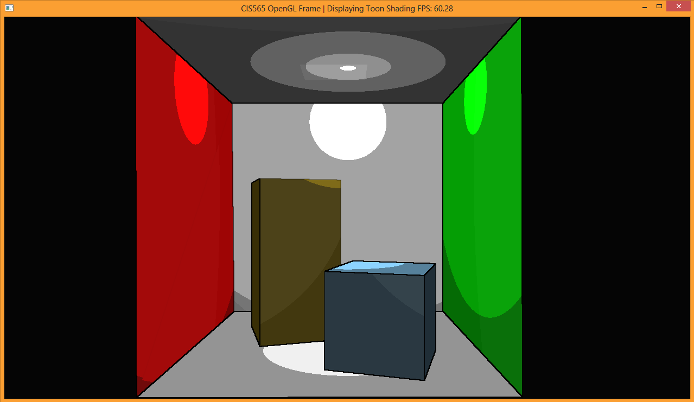
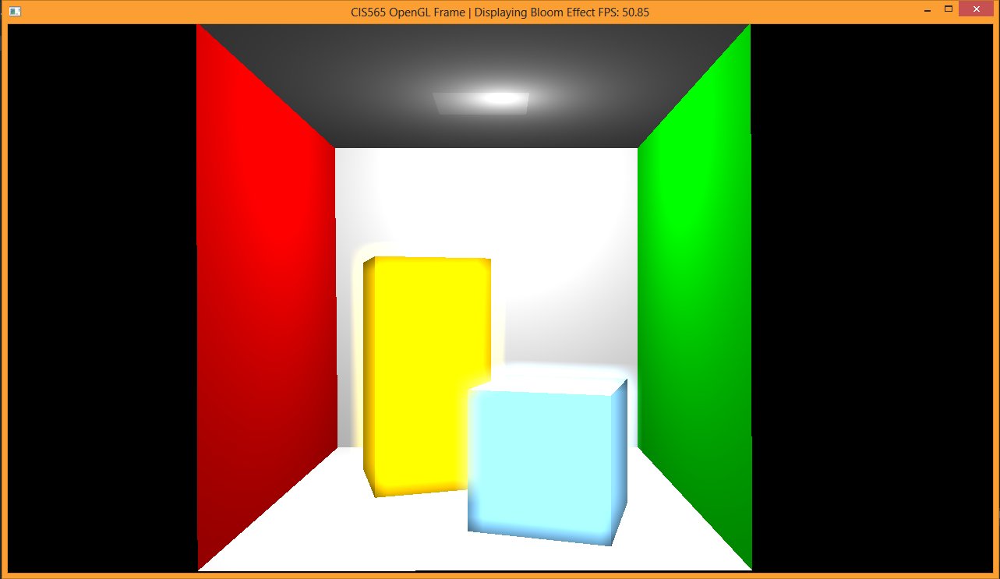
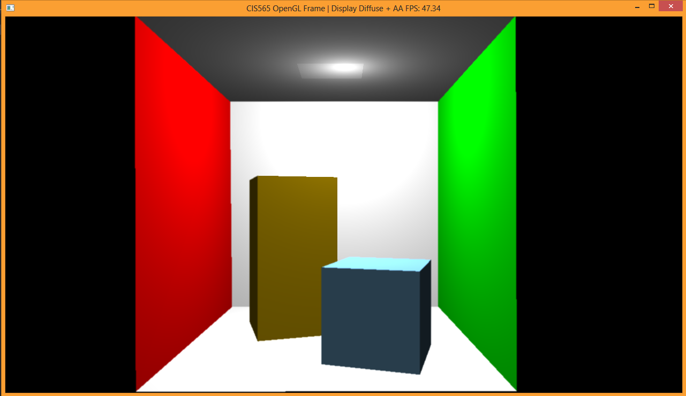
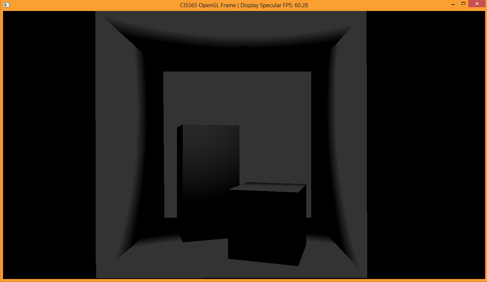
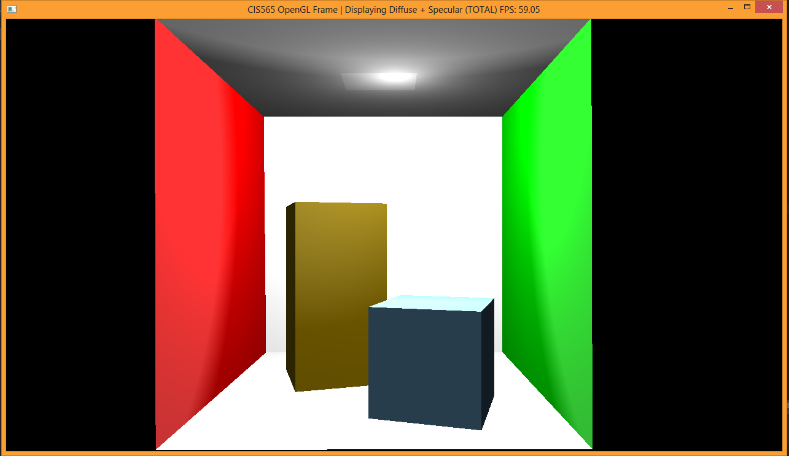
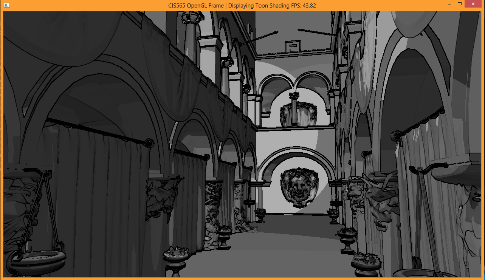
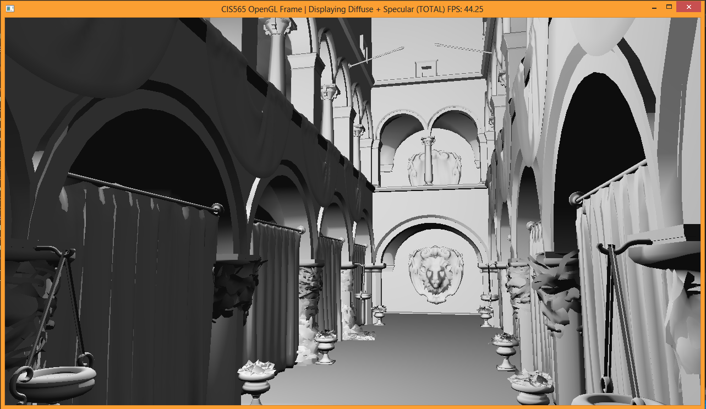
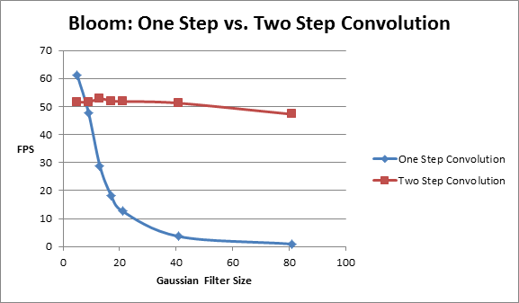

-------------------------------------------------------------------------------
CIS565: Project 6: Deferred Shader
-------------------------------------------------------------------------------

-------------------------------------------------------------------------------
RESULTS:
-------------------------------------------------------------------------------

-------------------------------------------------------------------------------
INTRODUCTION:
-------------------------------------------------------------------------------
In this project, I worked on implementing the basics of deferred shading. This is implemented with GLSL and OpenGL where various tasks such as
creating and writing to the G-Buffer were performed.

Stage 1 renders the scene geometry to the G-Buffer
* pass.vert
* pass.frag

Stage 2 renders the lighting passes and accumulates to the P-Buffer
* shade.vert
* ambient.frag
* point.frag
* diagnostic.frag

Stage 3 renders the post processing
* post.vert
* post.frag

Key binding overview:
WASDQZ - Movement
X - Toggle scissor test
R - Reload shaders
1 - View depth
2 - View eye space normals
3 - View Diffuse color
4 - View eye space positions
5 - View lighting
6 - View toon shading with silhouettes
7 - View scene with bloom effect
8 - View scene with anti-aliasing and diffuse lighting
9 - View specular map
0 - Standard view

-------------------------------------------------------------------------------
FEATURES:
-------------------------------------------------------------------------------

In this project, I have implemented the following features:

* Bloom effect with one pass and two pass convolution
* Toon shading with silhouettes
* Displaying point light sources
* Additional G buffer slot to store specular map
* Anti-aliasing via averaging on contours

-------------------------------------------------------------------------------
PERFORMANCE ANALYSIS
-------------------------------------------------------------------------------

I made a run time comparison between the one pass and two pass convolution techniques. Below is the chart that displays
the results.

As seen from above, when the size of the gaussian kernel is small, simply performing a one pass convolution is sufficient. However,
once the size increases past a certain point, the advantage of the two pass convolution technique becomes apparent.

---
ACKNOWLEDGEMENTS
---
This project makes use of [tinyobjloader](http://syoyo.github.io/tinyobjloader/) and [SOIL](http://lonesock.net/soil.html)
