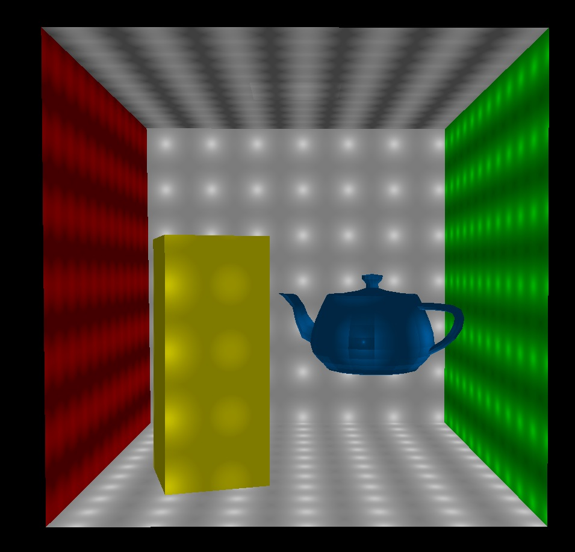
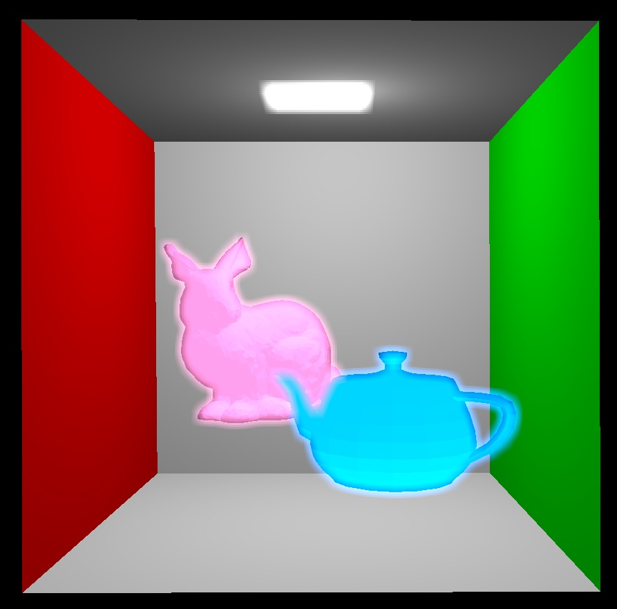
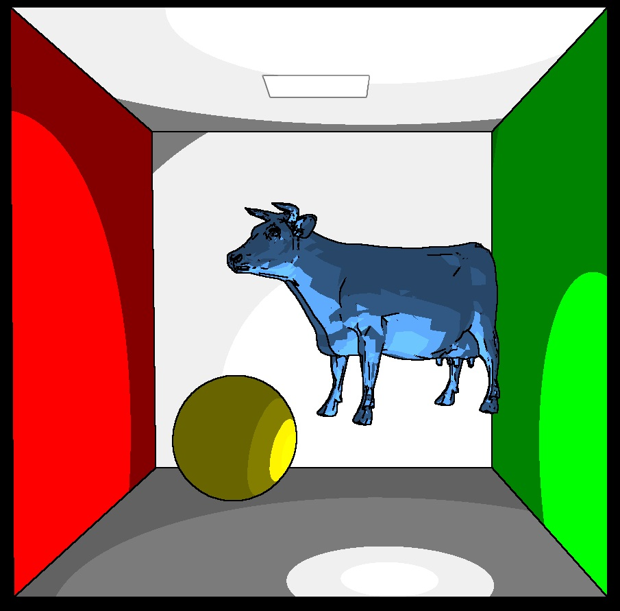
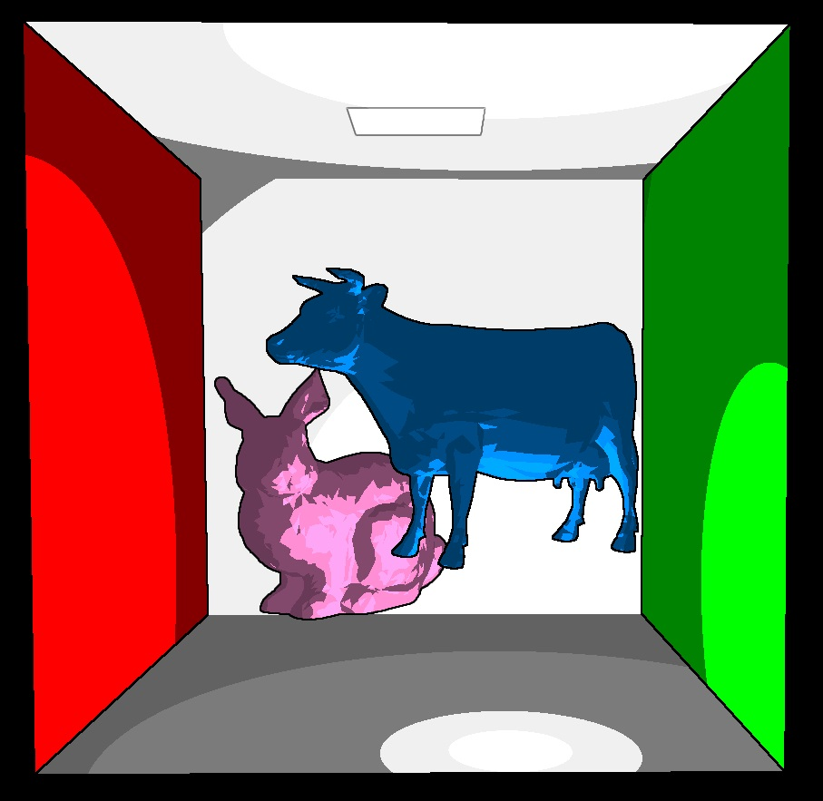
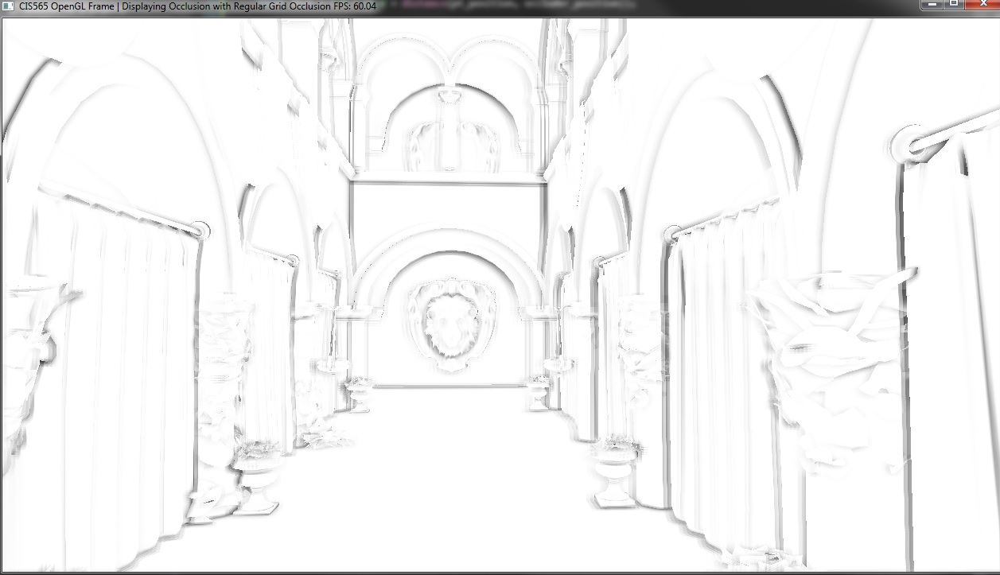
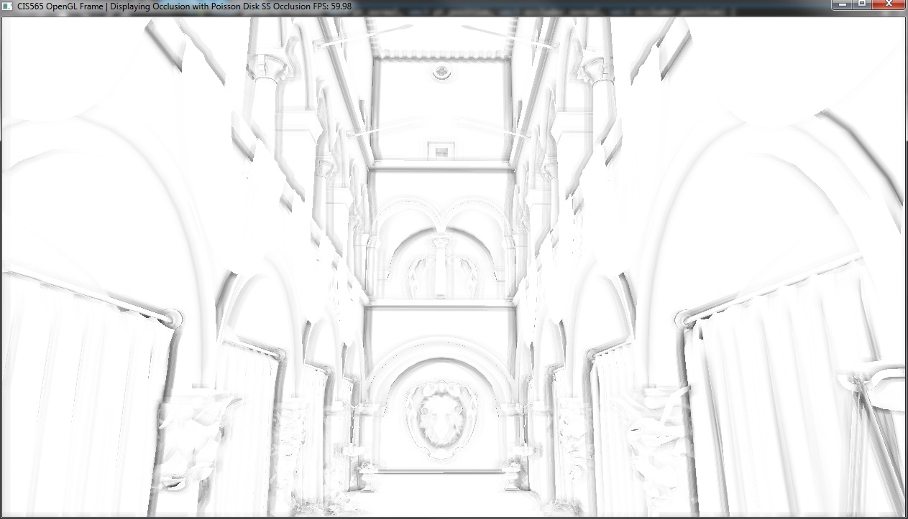
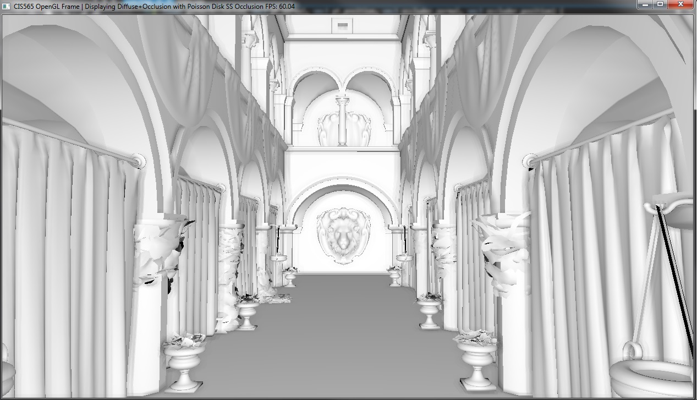

-------------------------------------------------------------------------------
CIS565: Project 6: Deferred Shader
-------------------------------------------------------------------------------

-------------------------------------------------------------------------------
Features:
-------------------------------------------------------------------------------

* Point Lights

* Bloom 

For the bloom effect, I created an additional G buffer to store the materials with 
bloom. Materials with Ka greater than 0 are assigned a value of 1, while materials with
a Ka of 0 and therefore doesn't glow are assigned a value of 0. I then apply a simple
Gaussian blur to the map and do an additive blend between the base color of the material
and the glow.

* Toon shading

For toon shading, I used a Sobel filter for basic edge detection. To 
create cel shading effect, I simply find the dot product between the normal and the
vector from the position to the light, and shade it based on the angle between these
2 vectors. 

* Screen Space Ambient Occlusion

I based my implementation off of last year's GLSL project. 

[Here] (http://zxyzhu.github.io/Project5-WebGL/) is a video of my deferred shader
running. 

-------------------------------------------------------------------------------
PERFORMANCE EVALUATION
-------------------------------------------------------------------------------
The performance evaluation is where you will investigate how to make your 
program more efficient using the skills you've learned in class. You must have
performed at least one experiment on your code to investigate the positive or
negative effects on performance. 

We encourage you to get creative with your tweaks. Consider places in your code
that could be considered bottlenecks and try to improve them. 

Each student should provide no more than a one page summary of their
optimizations along with tables and or graphs to visually explain any
performance differences.

-------------------------------------------------------------------------------
THIRD PARTY CODE POLICY
-------------------------------------------------------------------------------
* For screen space ambient occlusion, I used the base code from project 5 of the
CIS565 fall 2012 class. 

-------------------------------------------------------------------------------
SELF-GRADING
-------------------------------------------------------------------------------
* On the submission date, email your grade, on a scale of 0 to 100, to Liam, 
  liamboone@gmail.com, with a one paragraph explanation.  Be concise and 
  realistic.  Recall that we reserve 30 points as a sanity check to adjust your 
  grade.  Your actual grade will be (0.7 * your grade) + (0.3 * our grade).  We 
  hope to only use this in extreme cases when your grade does not realistically 
  reflect your work - it is either too high or too low.  In most cases, we plan 
  to give you the exact grade you suggest.
* Projects are not weighted evenly, e.g., Project 0 doesn't count as much as 
  the path tracer.  We will determine the weighting at the end of the semester 
  based on the size of each project.

---
SUBMISSION
---
As with the previous projects, you should fork this project and work inside of
your fork. Upon completion, commit your finished project back to your fork, and
make a pull request to the master repository.  You should include a README.md
file in the root directory detailing the following

* A brief description of the project and specific features you implemented
* At least one screenshot of your project running.
* A link to a video of your project running.
* Instructions for building and running your project if they differ from the
  base code.
* A performance writeup as detailed above.
* A list of all third-party code used.
* This Readme file edited as described above in the README section.

---
ACKNOWLEDGEMENTS
---
This project makes use of [tinyobjloader](http://syoyo.github.io/tinyobjloader/) and [SOIL](http://lonesock.net/soil.html)
