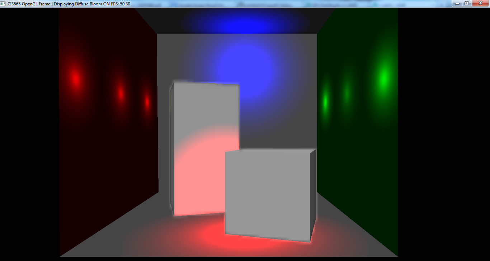
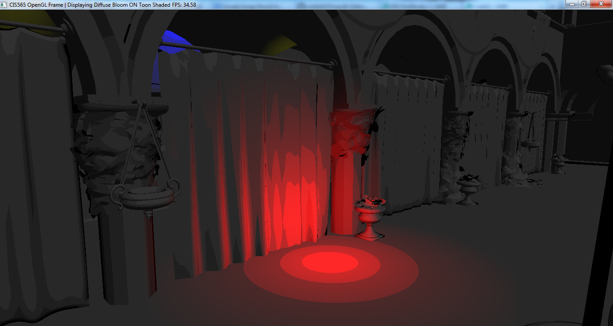
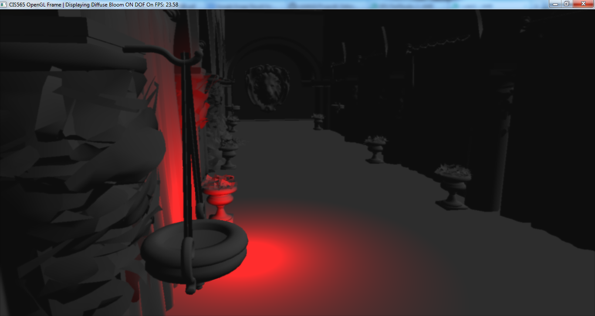

-------------------------------------------------------------------------------
CIS565: Project 6: Deferred Shader
-------------------------------------------------------------------------------
I implemented some parts of a deferred shader in this project using GLSL and OpenGL. Some basecode 
to do deferred shading was already provided by our TA, Liam Boone, which would render the position, 
normal and depth to a framebuffer in the first pass. I had to write code to use these values to perform 
shading of objects in the second pass.

##Interaction 
WASDQZ - Movement  
X - Toggle scissor test  
R - Reload shaders  
T - Toggle Cel Shading  
B - Toggle Bloom lighting  
F - Toggle Depth of Field (right click on an object on screen to set it at the focal plane)  
1 - View depth  
2 - View eye space normals  
3 - View Diffuse color  
4 - View eye space positions  
5 - View lighting debug mode  
6 - View glow map for bloom.  
0 - Standard view  
  
##Screenshots
Bloom lighting:  
  
Cel (Toon) shading:  
  
Depth of field with a really far focal plane:  
  

##Performance Evaluation
Since nearly all of the effects I've implemented (with the exception of Cel shading) have been done 
as post-process filters, I will describe below the performance hit due to enabling each:  
  
<table>
<tr>
<th>Effect</td>
<th>Average FPS</td>
</tr>
<tr>
<td>None</td>
<td>40</td>
</tr>
<tr>
<td>Bloom</td>
<td>35</td>
</tr>
<tr>
<td>Cel shading</td>
<td>35</td>
</tr>
<tr>
<td>DOF</td>
<td>35</td>
</tr>
<tr>
<td>Bloom + Cel shading</td>
<td>32</td>
</tr>
<tr>
<td>Bloom + Cel shading + DOF</td>
<td>25</td>
</tr>
<tr>
<td>Bloom + DOF</td>
<td>26</td>
</tr>
<tr>
<td>Cel shading + DOF</td>
<td>30</td>
</tr>
</table> 
  
As is discernible from the table above, DOF and Bloom are the most strenuous operations. A reading of the code 
supports these observations, as Bloom would require 9 texture lookups per pixel for a 3x3 Gaussian blur and DOF 
can require as much as 25.

##Acknowledgements
This project makes use of [tinyobjloader](http://syoyo.github.io/tinyobjloader/) and [SOIL](http://lonesock.net/soil.html)
