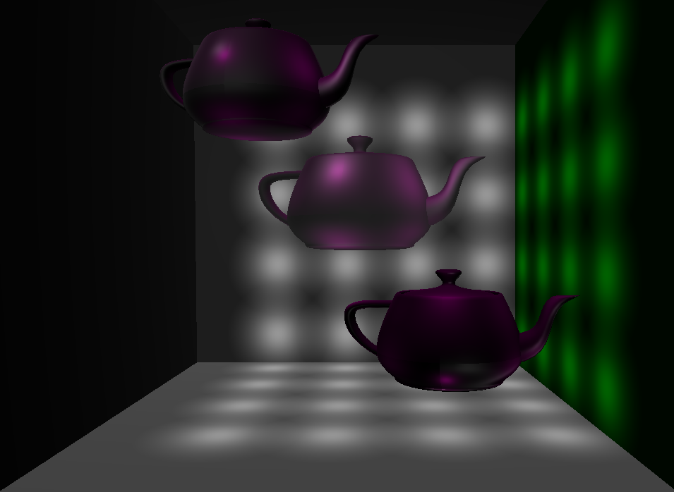
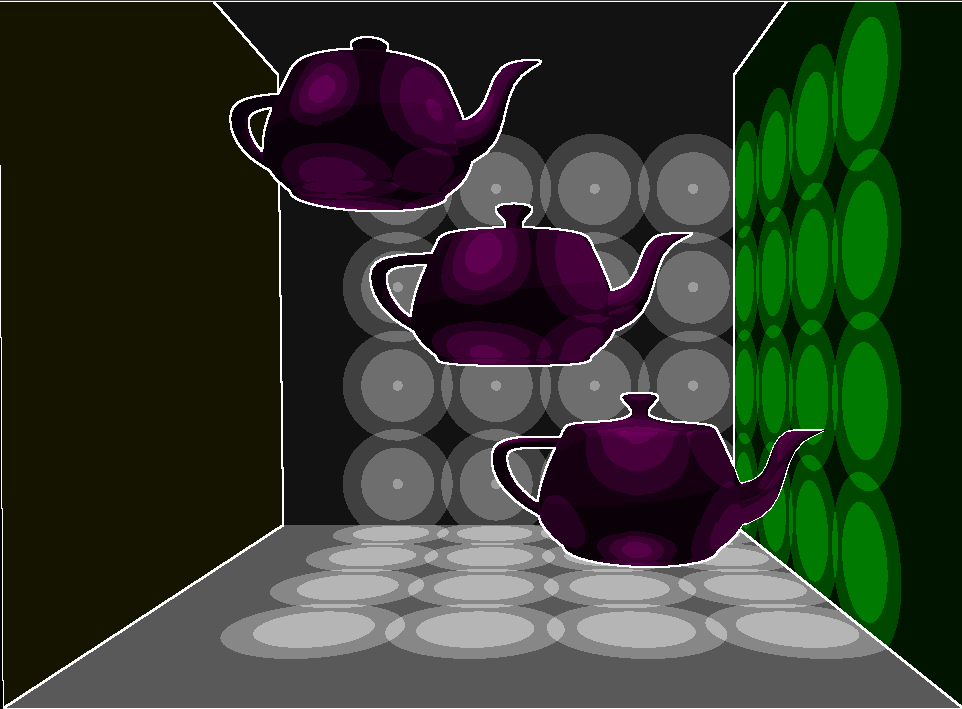

--------------------------------------------------------------------------------
DEFERRED SHADING
--------------------------------------------------------------------------------

* Above is a screenshot of this program, displaying 64 point lights, using [deferred shading](http://en.wikipedia.org/wiki/Deferred_shading). 
* With deferred shading, lighting computations are performed in SCREENSPACE, speeding up scenes with many lights / lots of geometry. 
* The most basic G-buffer has four channels: Diffuse, Color, Depth, and Normal. I added the ability to render materials with different specular coefficients by adding a specular channel to the G-buffer. 

* Toon shading. I adapted a [Lighthouse3D toon-shading tutorial](http://www.lighthouse3d.com/tutorials/glsl-tutorial/toon-shading-version-iii/) to use deferred shading rather than "regular" shading. 
* I use thresholding to draw color bands, and Sobel Filtering of the color part of the G-buffer to do contours.  
--------------------------------------------------------------------------------
CREDITS
--------------------------------------------------------------------------------
* Toon shading based on tutorial at http://www.lighthouse3d.com/tutorials/glsl-tutorial/toon-shading-version-iii/
* Base code from CIS565 / Liam Boone
