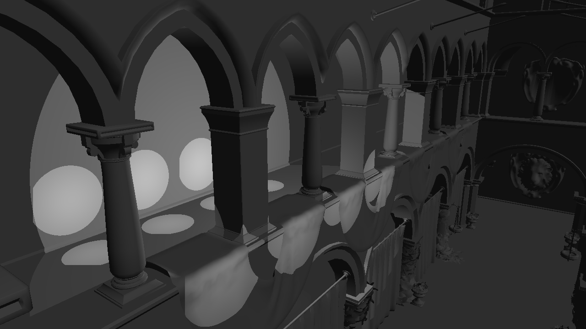

# Deferred Shader #

Screen space ambient occlusion

Tone Shading

Total

## Description: ##
In this project, I implemented separable convolution bloom effect, tone shading, point light, specular G buffer to display specular highlight and screen space ambient occlusion.

For the bloom effect, instead of doing one pass convolution, I did the two pass separable convolution which has a great speed up. For two pass, I added one more post fragment shader. I also make use of additional specular G buffer to determine which area to bloom. To define which material is effected by bloom effect, user just need to set Ns value to 101 in the .mtl file. I also using Gaussian blur effect for blurring the object.

For Tone shading, I am using sober matrix to multiply by the 9 different pixel color around current point. Then get the magnitude this pixel, using this magnitude to determine the color of current point. Also done in post fragment shader. 

For specular G buffer, I pass a vec4 value to fragment shader. This vec4 includes specular color and specular intensity. User can specify these values in .mtl file using Ks for specular color and Ns for specular intensity.

I did the SSAO using the poisson sphere which I got from 2012 fall GPU class. I implemented the grid space and world space SSAO. For the world space SSAO, I am using the current fragment to generate a random normal value. Using this random normal to reflect the vec3 of poisson sphere to get a more random position. I am using this position as the direction and make this random point pointing to the same direction of current point normal, which these random point consist of a hemisphere in front of current sample position in world space. After that, using the perspective matrix to get this new random point back to the screen space coordinate to get the ambient occlusion weighted value.    

Pree number change display mode.

- 1 Display depth
- 2 Display normal
- 3 Display color
- 4 Display position
- 5 Display light
- 6 Display tone shading
- 7 Display bloom effect
- 8 Display SSAO
- 0 Display total

## Performance Evaluation: ##

I did performance evaluation on one pass between two pass 2D convolution bloom effect. The two pass convolution has evident boost on frame rate. The most important reason is that the two pass convolution reduce the compute time from nxn to 2n.

I also did a evaluation on the number of lights and frame rates. Obviously, the frame rate goes down very quickly when the number of lights increase.

## Screen Shots ##

**Before Bloom Effect**

**After Bloom Effect**

**Tone Shading**

**Screen Space Ambient Occlusion**

**With out Specular**

**With Specular**

## To Do ##

- To reduce the artifacts in SSAO
- To specify more general way for bloom effect
 

---
ACKNOWLEDGEMENTS
---
This project makes use of [tinyobjloader](http://syoyo.github.io/tinyobjloader/) and [SOIL](http://lonesock.net/soil.html)
