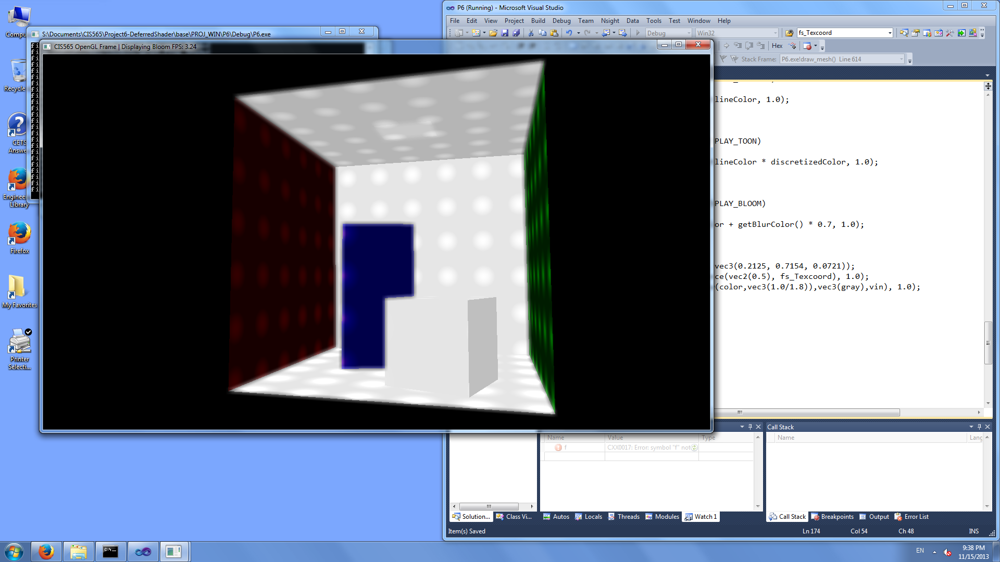

-------------------------------------------------------------------------------
CIS565: Project 6: Deferred Shader
-------------------------------------------------------------------------------
Fall 2013
-------------------------------------------------------------------------------
Due Friday 11/15/2013
-------------------------------------------------------------------------------

Implemented:
- Bloom (Press '8'): applies 13x13 box filter on anything that is white-ish. 
First tried with 5x5 Gaussian but was not blurry enough and was slowing down
too much.

- Toon (Press '7'): also press '6' to get outline.

- Point light sources

- Additional G buffer: Specular color (tall blue rectangle has red specular color)

- Store normal.x and normal.y into color.w and specularColor.w and compute
normal.z by sqrt(1-x*x-y*y). Unfortunately I was not able to observe performance
improvement:

-------------------------------------------------------------------------------
NOTE:
-------------------------------------------------------------------------------
This project requires any graphics card with support for a modern OpenGL 
pipeline. Any AMD, NVIDIA, or Intel card from the past few years should work 
fine, and every machine in the SIG Lab and Moore 100 is capable of running 
this project.

-------------------------------------------------------------------------------
INTRODUCTION:
-------------------------------------------------------------------------------
In this project, you will get introduced to the basics of deferred shading. You will write GLSL and OpenGL code to perform various tasks in a deferred lighting pipeline such as creating and writing to a G-Buffer.

-------------------------------------------------------------------------------
CONTENTS:
-------------------------------------------------------------------------------
The Project6 root directory contains the following subdirectories:
	
* base/
  * PROJ_WIN/ contains the vs2010 project files
  * PROJ_NIX/ contains makefile for building (tested on ubuntu 12.04 LTS)
  * res/ contains resources including shader source and obj files
  * src/ contains the c++ code for the project along with SOIL and tiny_obj_loader
* shared32/ contains freeglut, glm, and glew.

---
BASE CODE TOUR
---

Most of your edits will be confined to the various fragment shader programs and main.cpp.

Some methods worth exploring are:

[initShader](https://github.com/CIS565-Fall-2013/Project6-DeferredShader/blob/master/base/src/main.cpp#L223):
This method initializes each shader program from specified source files. Note that the source name is declared inside a `#ifdef WIN32` guard block. This is done to reflect the relative directory structure between the linux and windows versions of the code.

[initFBO](https://github.com/CIS565-Fall-2013/Project6-DeferredShader/blob/master/base/src/main.cpp#L360):
This method initializes the framebuffer objects used as render targets for the first and second stage of the pipeline. When you go to add another slot to the G buffer you will need to modify to first FBO accordingly. Try finding all the places where `colorTexture` is used (ctrl+F in windows will be helpful) and look at how textures are created, freed, added to the FBO, and assigned to the appropriate shader programs before adding your own. Also keep in mind that textures can be reused as inputs in other pipeline stages, for instance you might want access to the normals both in the lighting stage and in the post process stage.

[draw_mesh](https://github.com/CIS565-Fall-2013/Project6-DeferredShader/blob/master/base/src/main.cpp#L574),
[draw_quad](https://github.com/CIS565-Fall-2013/Project6-DeferredShader/blob/master/base/src/main.cpp#L647),
[draw_light](https://github.com/CIS565-Fall-2013/Project6-DeferredShader/blob/master/base/src/main.cpp#L657):
These methods render the scene geometry, viewing quad, and point light quad to the screen. The draw_light method in particular is interesting because it will set up the scissor window for efficient rendering of point lights.

[display](https://github.com/CIS565-Fall-2013/Project6-DeferredShader/blob/master/base/src/main.cpp#L742):
This is where the graphical work of your program is done. The method is separated into three stages with the majority of work being done in stage 2.

Stage 1 renders the scene geometry to the G-Buffer
* pass.vert
* pass.frag

Stage 2 renders the lighting passes and accumulates to the P-Buffer
* shade.vert
* ambient.frag
* point.frag
* diagnostic.frag

Stage 3 renders the post processing
* post.vert
* post.frag

[keyboard](https://github.com/CIS565-Fall-2013/Project6-DeferredShader/blob/master/base/src/main.cpp#L870):
This is a good reference for the key mappings in the program. 
WASDQZ - Movement
X - Toggle scissor test
R - Reload shaders
1 - View depth
2 - View eye space normals
3 - View Diffuse color
4 - View eye space positions
5 - View lighting debug mode
0 - Standard view

-------------------------------------------------------------------------------
REQUIREMENTS:
-------------------------------------------------------------------------------

In this project, you are given code for:
* Loading .obj files
* Rendering to a minimal G buffer:
  * Depth
  * Normal
  * Color
  * Eye space position
* Rendering simple ambient and directional lighting to texture
* Example post process shader to add a vignette

You are required to implement:
* Either of the following effects
  * Bloom (feel free to use [GPU Gems](http://http.developer.nvidia.com/GPUGems/gpugems_ch21.html) as a rough guide)
  * "Toon" Shading (with basic silhouetting)
* Point light sources
* An additional G buffer slot and some effect showing it off

**NOTE**: Implementing separable convolution will require another link in your pipeline and will count as an extra feature if you do performance analysis with a standard one-pass 2D convolution. The overhead of rendering and reading from a texture _may_ offset the extra computations for smaller 2D kernels.

You must implement two of the following extras:
* The effect you did not choose above
* Screen space ambient occlusion
* Compare performance to a normal forward renderer with
  * No optimizations
  * Coarse sort geometry front-to-back for early-z
  * Z-prepass for early-z
* Optimize g-buffer format, e.g., pack things together, quantize, reconstruct z from normal x and y (because it is normalized), etc.
  * Must be accompanied with a performance analysis to count
* Additional lighting and pre/post processing effects! (email first please, if they are good you may add multiple).

-------------------------------------------------------------------------------
README
-------------------------------------------------------------------------------
All students must replace or augment the contents of this Readme.md in a clear 
manner with the following:

* A brief description of the project and the specific features you implemented.
* At least one screenshot of your project running.
* A 30 second or longer video of your project running.  To create the video you
  can use http://www.microsoft.com/expression/products/Encoder4_Overview.aspx 
* A performance evaluation (described in detail below).

-------------------------------------------------------------------------------
PERFORMANCE EVALUATION
-------------------------------------------------------------------------------
The performance evaluation is where you will investigate how to make your 
program more efficient using the skills you've learned in class. You must have
performed at least one experiment on your code to investigate the positive or
negative effects on performance. 

We encourage you to get creative with your tweaks. Consider places in your code
that could be considered bottlenecks and try to improve them. 

Each student should provide no more than a one page summary of their
optimizations along with tables and or graphs to visually explain any
performance differences.

-------------------------------------------------------------------------------
THIRD PARTY CODE POLICY
-------------------------------------------------------------------------------
* Use of any third-party code must be approved by asking on the Google groups.  
  If it is approved, all students are welcome to use it.  Generally, we approve 
  use of third-party code that is not a core part of the project.  For example, 
  for the ray tracer, we would approve using a third-party library for loading 
  models, but would not approve copying and pasting a CUDA function for doing 
  refraction.
* Third-party code must be credited in README.md.
* Using third-party code without its approval, including using another 
  student's code, is an academic integrity violation, and will result in you 
  receiving an F for the semester.

-------------------------------------------------------------------------------
SELF-GRADING
-------------------------------------------------------------------------------
* On the submission date, email your grade, on a scale of 0 to 100, to Liam, 
  liamboone@gmail.com, with a one paragraph explanation.  Be concise and 
  realistic.  Recall that we reserve 30 points as a sanity check to adjust your 
  grade.  Your actual grade will be (0.7 * your grade) + (0.3 * our grade).  We 
  hope to only use this in extreme cases when your grade does not realistically 
  reflect your work - it is either too high or too low.  In most cases, we plan 
  to give you the exact grade you suggest.
* Projects are not weighted evenly, e.g., Project 0 doesn't count as much as 
  the path tracer.  We will determine the weighting at the end of the semester 
  based on the size of each project.

---
SUBMISSION
---
As with the previous projects, you should fork this project and work inside of
your fork. Upon completion, commit your finished project back to your fork, and
make a pull request to the master repository.  You should include a README.md
file in the root directory detailing the following

* A brief description of the project and specific features you implemented
* At least one screenshot of your project running.
* A link to a video of your project running.
* Instructions for building and running your project if they differ from the
  base code.
* A performance writeup as detailed above.
* A list of all third-party code used.
* This Readme file edited as described above in the README section.

---
ACKNOWLEDGEMENTS
---
This project makes use of [tinyobjloader](http://syoyo.github.io/tinyobjloader/) and [SOIL](http://lonesock.net/soil.html)
