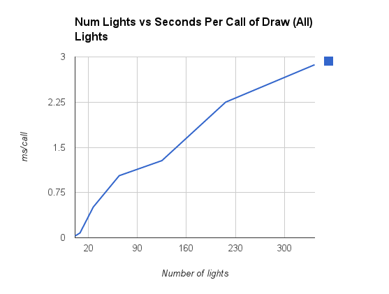

--------------------------------------------------------------------------------
DEFERRED SHADING
--------------------------------------------------------------------------------

* Above is a screenshot of this program, displaying 64 point lights, using [deferred shading](http://en.wikipedia.org/wiki/Deferred_shading). 
* With deferred shading, lighting computations are performed in SCREENSPACE, speeding up scenes with many lights / lots of geometry. 
* The most basic G-buffer has four channels: Diffuse, Color, Depth, and Normal. I added the ability to render materials with different specular coefficients by adding a specular channel to the G-buffer. 

* Toon shading. I adapted a [Lighthouse3D toon-shading tutorial](http://www.lighthouse3d.com/tutorials/glsl-tutorial/toon-shading-version-iii/) to use deferred shading rather than "regular" shading. 
* I use thresholding to draw color bands, and Sobel Filtering of the color part of the G-buffer to do contours.  
* See the following video (it's easier to get an idea of the three different specular powers on the teapots, plus toon shading): http://youtu.be/gN2i6lefSRA

--------------------------------------------------------------------------------
Performance Analysis
--------------------------------------------------------------------------------
* Below is a plot of number of lights vs. time to draw the lights. As we would expect, it's roughly
linear. Note that we can draw a very high number of lights and still draw them extremely fast (even when 
drawing over 300 lights, it still took aroun 3 ms to draw all of them).

--------------------------------------------------------------------------------
CREDITS
--------------------------------------------------------------------------------
* Toon shading based on tutorial at http://www.lighthouse3d.com/tutorials/glsl-tutorial/toon-shading-version-iii/
* Base code from CIS565 / Liam Boone
