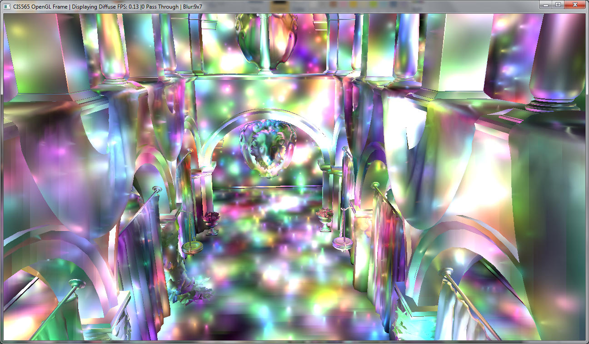
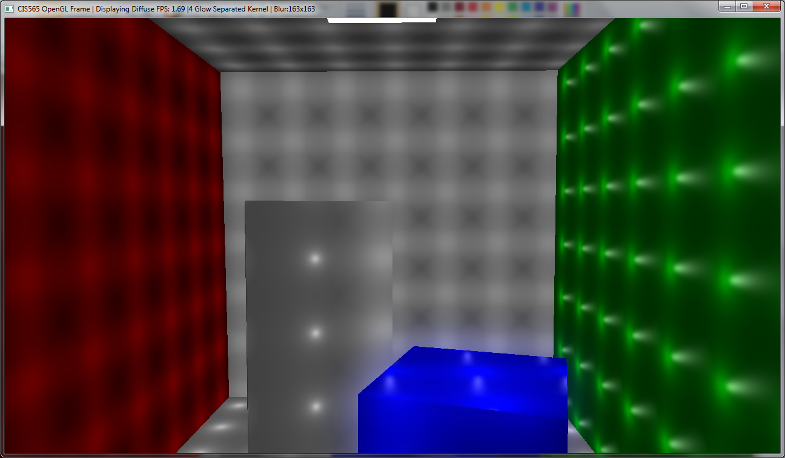
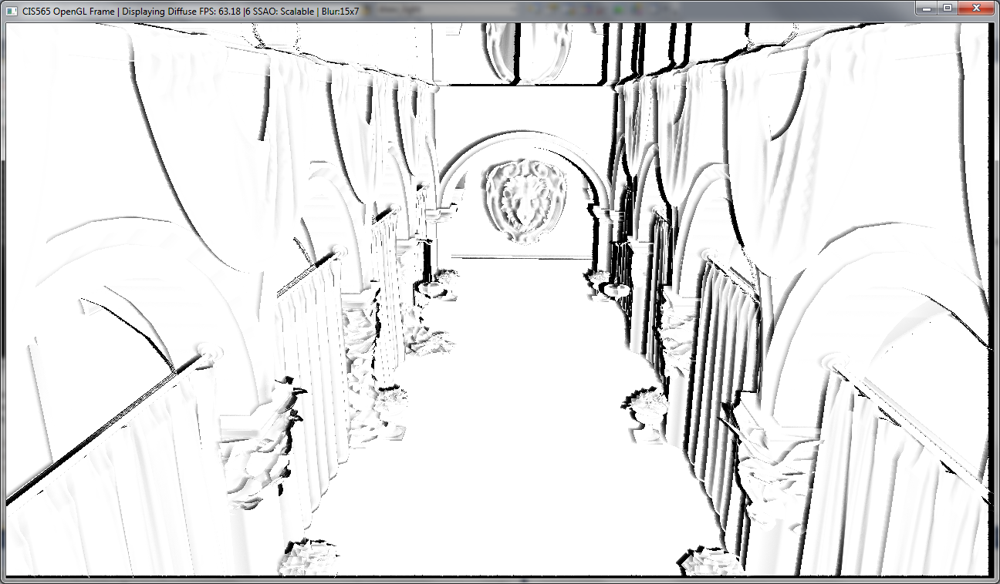

-------------------------------------------------------------------------------
CIS565: Project 6: Deferred Shader
-------------------------------------------------------------------------------
Fall 2013
-------------------------------------------------------------------------------

---
Deferred Shading
---

The whole point of deferred shading is to separate geometry from lighting calculations and change the lighting equation from an O(GE) into an O(G+E) problem. To that effect, I rendered the Sponza scene with a large number of lights.

333K Lights, randomly colored and positioned



15K Lights


###Controls
* Up-Down : Change Y size of kernel
* Left-Right : Change X size of kernel
* [ : Toggle back one step in *modes*
* ] : Toggle forward one step in *modes*
* 1 : Depth Visual
* 2 : Normal Visual
* 3 : Color Visual
* 4 : Position Visual
* 5 : Light Visual
* 0 : Main Mode

###Modes
* Simple pass through effect
* Bloom with 2D Kernel
* Bloom with Separable Kernel
* Glow with 2D Kernel
* Bloom with Separable Kernel
* Vignette
* SSAO Pass
* SSAO Blended Pass


--- 
Features
---

The following features were implemented.

####Bloom Shading (2D separable kernels implemented)
All pixels beyond a certain threshold in value (after lighting) were blurred based on the x and y radius. This can be seen below:

No Bloom:


Y-direction only bloom:


The separability of the 2D Gaussian kernel was exploited using yet another frame buffer object and extra textures to ping-pong with and uses the following pipeline:


This separability of blur is a massive speed improvement. This is discussed further in the performance section.

####Glow Shading : Extra G-Buffer slot

The object "short box" is selected based on its name and made to glow using a similar separable-blur technique as is used for the bloom shading. This uses an extra G-Buffer slot: the alpha channel of the position texture. A value of 0 or 1 is written out here based on whether the object being rendered is the "short box" or not.

No Glow:


With Glow:



####Specular Highlights: Compacted G-Buffer usage

Since I'm personally fond of specular highlights, I decided to use them in the code. I've picked up the specular value from the mtl files of the obj loaded and it is packed into a G Buffer during the first phase of the system. Since the glow buffer is quite a waste of a 32 bit floating point value for just the 0 or 1 glow, I decided to use it for specular exponent as well.

The buffer is packed as ````2 * spec_ex + glow? ```` and decoded when required.

You can see the specular as a little white dash on the green wall and a little bit on the blue box as well.


####Screen Space Ambient Occlusion (attempt)
I based my implementation on this [paper](http://graphics.cs.williams.edu/papers/SAOHPG12/) and referred to their implementation and pseudo code along with trying to over randomize the inputs to the code. I couldn't get it to work entirely correctly but this is the result I get.




####Light Visualization
Lights can be visualized in the scene as follows


---
Performance
---
I must say, I'm very impressed with the number of lights that are handled by a deferred shading pipeline for extremely complex geometry without completely blocking up the GPU. It's amazing to see this delineation of lighting calculation and a nice geometry pass. 

Since I did separable kernels, I decided to graph out the time. As noticed, since the separation of a 2D kernel results in a change from O(MN) to O(M+N) (quite like deferred shading itself!), we are able to run much much larger kernel sizes off the bat. We notice that there is a slight overhead of creating yet another frame buffer object and having to setup another texture, but compared to the speed up, this cost is marginal. It is overtaken by the lowest of texture look up calls (10 vs 6+overhead).


---
Coming up soon
---
I have a few cool screen space effects planned out in the near future.

---
ACKNOWLEDGEMENTS
---
* This project makes use of [tinyobjloader](http://syoyo.github.io/tinyobjloader/) and [SOIL](http://lonesock.net/soil.html)
* For reference on SSAO implementation [Separabe, screen space Ambient Occlusion](http://floored.com/blog/2013/ssao-screen-space-ambient-occlusion.html)
