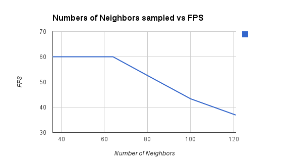

-------------------------------------------------------------------------------
CIS565: Project 6: Deferred Shader
-------------------------------------------------------------------------------

-------------------------------------------------------------------------------
Features:
-------------------------------------------------------------------------------

* Point Lights

* Bloom 

For the bloom effect, I created an additional G buffer to store the materials with 
bloom. Materials with Ka greater than 0 are assigned a value of 1, while materials with
a Ka of 0 and therefore doesn't glow are assigned a value of 0. I then apply a simple
Gaussian blur to the map and do an additive blend between the base color of the material
and the glow.

* Toon shading

For toon shading, I used a Sobel filter for basic edge detection. To 
create cel shading effect, I simply find the dot product between the normal and the
vector from the position to the light, and shade it based on the angle between these
2 vectors. 

* Screen Space Ambient Occlusion

I based my implementation off of last year's GLSL project. 

[Here](https://vimeo.com/79531738) is a video of my deferred shader
running. 

-------------------------------------------------------------------------------
PERFORMANCE EVALUATION
-------------------------------------------------------------------------------

Number of Lights

With scissor test, nearly 3000 lights can be rendered without a major performance
hit. After 3000 lights, however, the number of texture reads becomes very high and
there is a sharp drop in performance. Without the scissor test, the scene can barely
handle 700 lights. 

Number of neighbors sampled for bloom effect

When blurring the glow texture, FPS stays at 60 when the number of samples taken is 
under 64. When the number of samples go above 64, performance decreases to about 30 
FPS since the number of texture reads become very high.  

-------------------------------------------------------------------------------
THIRD PARTY CODE POLICY
-------------------------------------------------------------------------------
* For screen space ambient occlusion, I used the base code from project 5 of the
CIS565 fall 2012 class. 

---
ACKNOWLEDGEMENTS
---
This project makes use of [tinyobjloader](http://syoyo.github.io/tinyobjloader/) and [SOIL](http://lonesock.net/soil.html)
