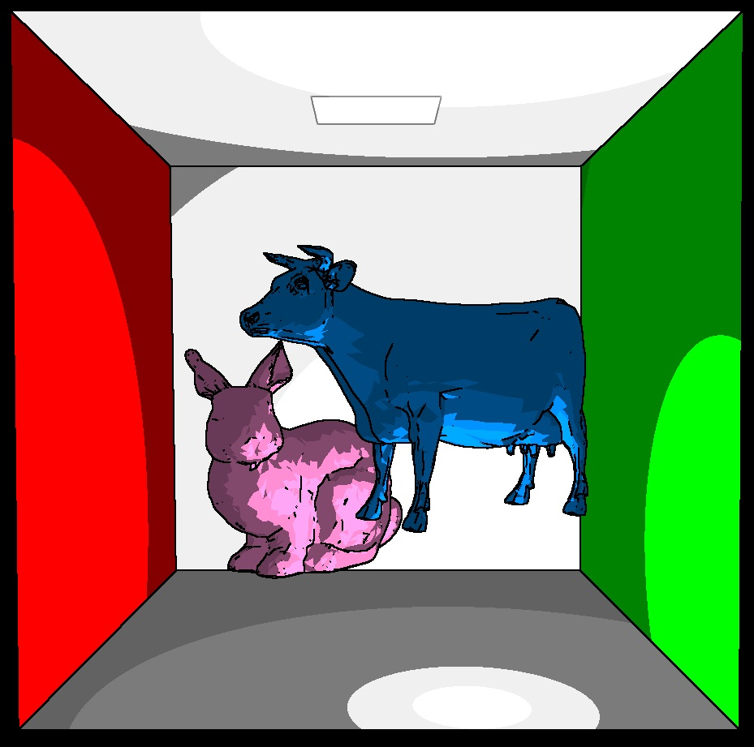

-------------------------------------------------------------------------------
CIS565: Project 6: Deferred Shader
-------------------------------------------------------------------------------

-------------------------------------------------------------------------------
Features:
-------------------------------------------------------------------------------

* Point Lights

* Bloom 

For the bloom effect, I created an additional G buffer to store the materials with 
bloom. Materials with Ka greater than 0 are assigned a value of 1, while materials with
a Ka of 0 and therefore doesn't glow are assigned a value of 0. I then apply a simple
Gaussian blur to the map and do an additive blend between the base color of the material
and the glow.

* Toon shading

For toon shading, I used a Sobel filter for basic edge detection. To 
create cel shading effect, I simply find the dot product between the normal and the
vector from the position to the light, and shade it based on the angle between these
2 vectors. 

* Screen Space Ambient Occlusion

I based my implementation off of last year's GLSL project. 

[Here](https://vimeo.com/79531738) is a video of my deferred shader
running. 

-------------------------------------------------------------------------------
PERFORMANCE EVALUATION
-------------------------------------------------------------------------------

The performance evaluation is where you will investigate how to make your 
program more efficient using the skills you've learned in class. You must have
performed at least one experiment on your code to investigate the positive or
negative effects on performance. 

We encourage you to get creative with your tweaks. Consider places in your code
that could be considered bottlenecks and try to improve them. 

Each student should provide no more than a one page summary of their
optimizations along with tables and or graphs to visually explain any
performance differences.

-------------------------------------------------------------------------------
THIRD PARTY CODE POLICY
-------------------------------------------------------------------------------
* For screen space ambient occlusion, I used the base code from project 5 of the
CIS565 fall 2012 class. 

---
ACKNOWLEDGEMENTS
---
This project makes use of [tinyobjloader](http://syoyo.github.io/tinyobjloader/) and [SOIL](http://lonesock.net/soil.html)
