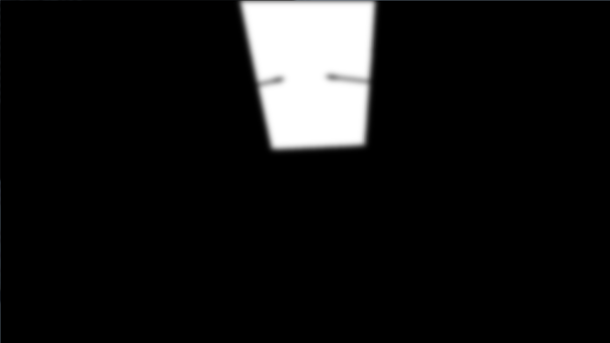

-------------------------------------------------------------------------------
Deferred Shader
-------------------------------------------------------------------------------
Fall 2013
-------------------------------------------------------------------------------

-------------------------------------------------------------------------------
FEATURES:
-------------------------------------------------------------------------------

This project demostrates various effects that can be achieved by deferred shading in OpenGL, including:

###Basic features:
* Rendering to G buffer:
  * Depth
  * Normal
  * Color
  * Eye space position
* Rendering simple ambient and directional lighting to texture
* Post process shader to add a vignette

###Advanced features:
* Bloom with separable filter for Gaussian blur
* Toon Shading with Canny Edge detection
* Point light sources
* Glowmap G-buffer slot
* Screen space ambient occlusion (SSAO)

###Input:
* 1: (linear) Depth shading
* 2: Eye space normal
* 3: Flat shading
* 4: Eye space position
* 5: Diffuse shading with point light and directional light
* 6: Toon shading
* Shift+6: Toon shading with silhouette
* 7: Blooming
* Shift+7: Glow map used for blooming
* 8: Screen Space ambient occlusion
* 0: Directional light only

-------------------------------------------------------------------------------
SCREENSHOTS:
-------------------------------------------------------------------------------
####Point light source

####Toon Shading

####Toon Shading with Edge

####Blooming 

####Diffuse lighting without Screen Space Ambient Occlusion

####Diffuse lighting with Screen Space Ambient Occlusion

####Sponza blooming

####Glow map used for Sponza blooming

-------------------------------------------------------------------------------
PERFORMANCE EVALUATION
-------------------------------------------------------------------------------
This section will come later.

---
HOW TO BUILD
---

This project make use of OpenGL 4.4 with support of multidimensional arrays, just for performance comparison sake. Make sure you have the latest driver support.

---
ACKNOWLEDGEMENTS
---
* This project makes use of [tinyobjloader](http://syoyo.github.io/tinyobjloader/) and [SOIL](http://lonesock.net/soil.html)
* References for edge detection algorithm used in toon shader:
	* [Wikipedia Canny edge detector page](http://en.wikipedia.org/wiki/Canny_edge_detector)
	* [Wikipedia Sobel operator page](http://en.wikipedia.org/wiki/Sobel_operator)
	* [Songho's page for 2D convolution](http://www.songho.ca/dsp/convolution/convolution.html)
* References for blooming effect:
    * [GPU Gem chapter](http://http.developer.nvidia.com/GPUGems/gpugems_ch21.html) 
	* [Devmaster Tutorial](http://devmaster.net/posts/3100/shader-effects-glow-and-bloom)	
	* [Non-maximal suppression](http://http.developer.nvidia.com/GPUGems2/gpugems2_chapter40.html)
* References for SSAO implementation:
	* [Devmaster Tutorial](http://devmaster.net/posts/3095/shader-effects-screen-space-ambient-occlusion)
	* [Game Dev Tutorial](http://www.gamedev.net/page/resources/_/technical/graphics-programming-and-theory/a-simple-and-practical-approach-to-ssao-r2753)
	* [Base code for SSAO from CIS565 Fall 2012](https://github.com/CIS565-Fall-2012/Project5-AdvancedGLSL)

