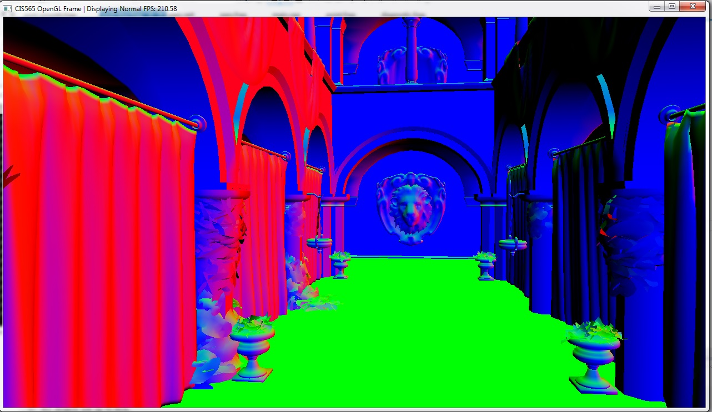

-------------------------------------------------------------------------------
Deferred Renderer
-------------------------------------------------------------------------------
 
Deferred shading is a mulit-pass rendering approach. The scene primitives are usually rendered once per frame (or per material), and the information needed for shading (position, normal, depth, albedo, etc.) are output to multiple render targets, a 
group of image buffers that have the same size as the output screen.  
Then in the subequent passes, a screen-sized quad is rendered and shading is performed using information provided by the buffers obtained from the primitive-rendering pass.  
Unlike traditional forward rendering approach, which has to render the same primitives multiple times when multiple lights are present, 
deferred shading can reuse the shading information without rendering the scene over and over again.  
Thus the shading complexity is decoupled from scene complexity. 

This project implements deferred renderer using OpenGL's Framebuffer Objects; it demonstrates the following effects:  
* Diffuse material shading
* Toon shading with silhouette
* Scren space ambient occlusion (SSAO)
* Motion blur  
  
by using the following buffers generated in the primitive-rendering pass:  
* Depth
* Surface normal
* Albedo 
* Velocity field  

Mutiple post-processing passes are performed:  
* SSAO calculation
* SSAO smoothing
* Motion blurring
* Toon shading silhouette (using Sobel filter on both depth and normal)

Rendering result
---------------------------------------------------------------------------------
Diffuse shading+SSAO:
  
  
  
Motion blur effect:  
  

Toon Shading:

  
Depth buffer: 
  

Normal buffer: 
  

Ambient Occlusion before smoothing:
  

Ambient ccclusion after smoothing:
  
  
    
Performance Evaluation:
----------------------------------------------------------------------------------
Three kinds of render targets layouts were tested:  

  
* 4 X RGBA32F floating point textures + 32bit depth buffer:  

  
  
* 2 X RGBA32F floating point textures + 32bit depth buffer:  
  (Positions are reconstructed on the fly from detph values)  
  
  
  
* 2 X RGBA8 UCHAR textures + 32bit depth buffer:  
  (Positions are reconstructed on the fly from detph values)  
  
 
 

 
The following chart shows how size and precision of render targets affect performance:  

  

The chart shows how FPS changes when rendering using different render target precisions and sizes.  
The test is run on a GTX660M laptop.  

Although 8-bit precision textures yields better performance, error arises when using them for shading.  
 
The following images are the rendering results using 8-bit depth textures.   

  

